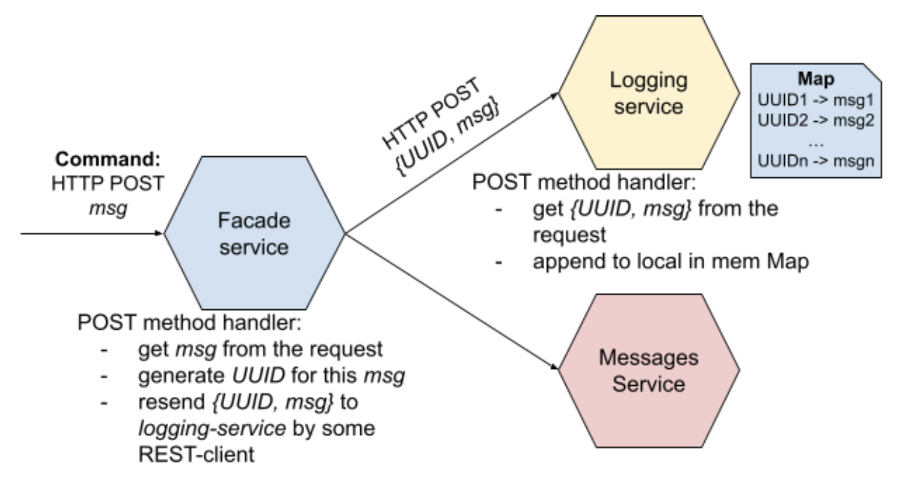
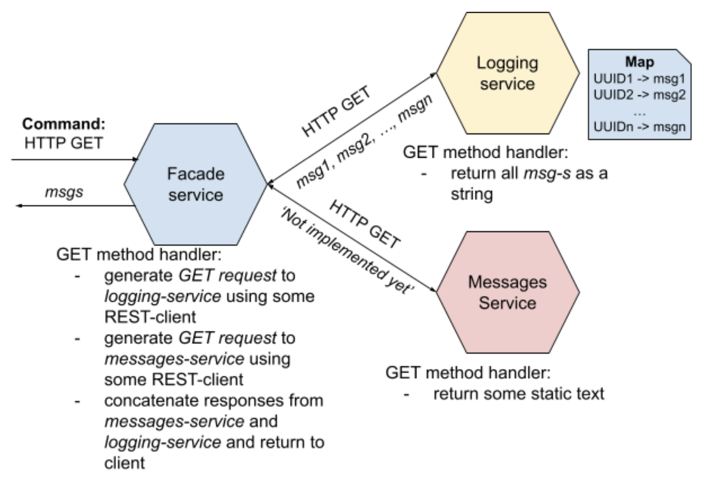
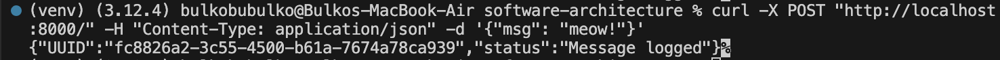
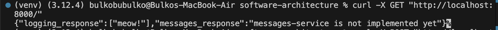
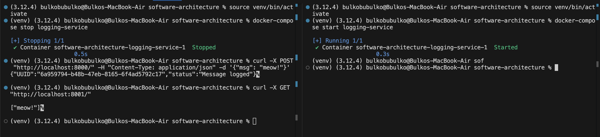

Task 1 - Basic Microservices Architecture

## Microservices architecture



## Architecture consists of three microservices:

- facade-service – accepts POST/GET requests from the client
- logging-service – stores all incoming messages in memory and can return them
- messages-service – currently acts as a placeholder, returning a static message when accessed

## Build and run the services
```
docker-compose down --remove-orphans && docker-compose up --build -d
```

## Example usage
### POST request:

```
curl -X POST "http://localhost:8000/" -H "Content-Type: application/json" -d '{"msg": "meow!"}'
```

Expected response:



### GET Request:

```
curl -X GET "http://localhost:8000/"
```

Expected response:



## Additional Tasks
1. Retry mechanism and message deduplication.

Tested on such scenario:
- start all services
- stop `logging-service`
- send POST request to `facade-service`
- start `logging-service` before max retries reached
- check if message is logged exactly once

Expected behavior:
