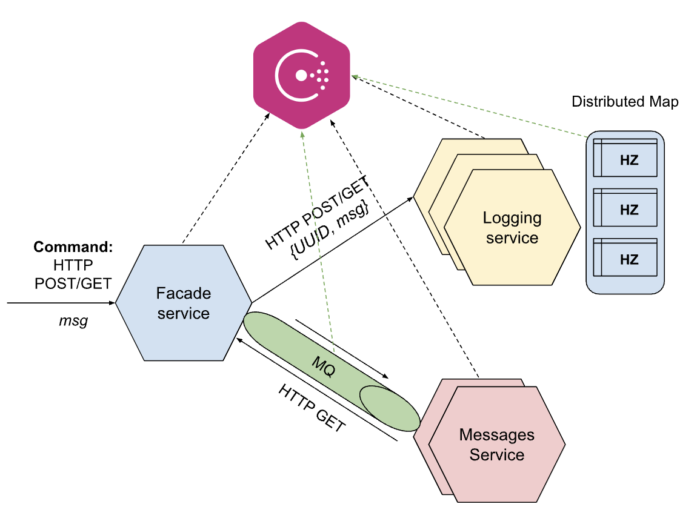
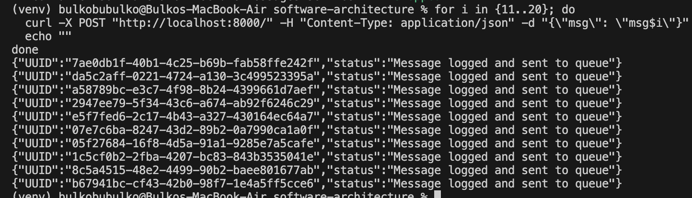
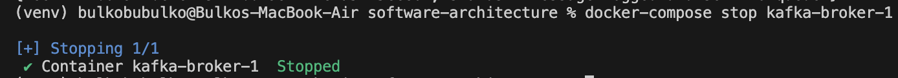
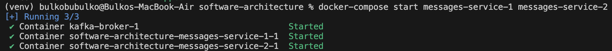
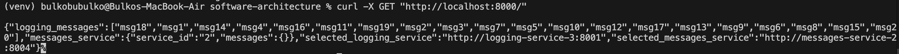

# Task 4 - Microservices using Messaging queue

## Microservices architecture
For this task we update architecture as such:


## Architecture consists of three microservices:

- facade-service – accepts POST/GET requests from the client;
- logging-service – stores all incoming messages in memory and can return them;
- messages-service – previously acted as a placeholder, returning a static message when accessed; in this task we update its functionality by using a **message queue** as the communication channel between the facade-service and the messages-service + make it possible to up several coppies of messages-service. now facade-service randomly chooses which copy of messages-service to access to read message. 

[Kafka](https://hub.docker.com/r/apache/kafka) is used as the message queue.

## Build and run the services
```
docker-compose down --remove-orphans && docker-compose up --build -d
```

Send 10 messages through the facade service
```
for i in {1..10}; do
  curl -X POST "http://localhost:8000/" -H "Content-Type: application/json" -d "{\"msg\": \"msg$i\"}"
  echo ""
done
```


Check the logs to see which messages were received by each logging service
```
docker-compose logs logging-service-1
docker-compose logs logging-service-2
docker-compose logs logging-service-3
```


Check the logs to see which messages were received by each messages service
```
docker-compose logs messages-service-1
docker-compose logs messages-service-2
```


Get all messages
```
curl -X GET "http://localhost:8000/"
```


Now lets do fault tolerance test!

First we stop both message services
```
docker-compose stop messages-service-1 messages-service-2
```


And send more messages
```
for i in {11..20}; do
  curl -X POST "http://localhost:8000/" -H "Content-Type: application/json" -d "{\"msg\": \"msg$i\"}"
  echo ""
done
```



Now we stop Kafka broker, here it chooses the leader 
```
docker-compose stop kafka-broker-1
```



Start the message services again
```
docker-compose start messages-service-1 messages-service-2
```


And lets get all messages. It shows that all messages were processed, even though one Kafka broker was down during the restart
```
curl -X GET "http://localhost:8000/"
```

