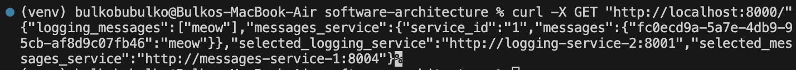

# Homework 3

## Microservices architecture


For this task we update architecture as such:


## Architecture consists of three microservices:

- facade-service – accepts POST/GET requests from the client
- logging-service – stores all incoming messages in memory and can return them
- messages-service – currently acts as a placeholder, returning a static message when accessed

## Build and run the services
```
docker-compose down --remove-orphans && docker-compose up --build -d
```

Send 10 messages through the facade service
```
for i in {1..10}; do
  curl -X POST "http://localhost:8000/" -H "Content-Type: application/json" -d "{\"msg\": \"msg$i\"}"
  echo ""
done
```


Check the logs to see which messages were received by each service
```
docker-compose logs logging-service-1
docker-compose logs logging-service-2
docker-compose logs logging-service-3
```


Get all messages
```
curl -X GET "http://localhost:8000/"
```



Stop logging service
```
docker-compose stop logging-service-1
```


Get all messages after stopping loggin service
```
curl -X GET "http://localhost:8000/"
```


Even after stopping one of loggin services we still have all the messages!

