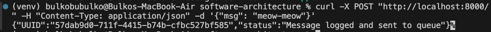

# Task 5 - Microservices using Service Discovery and Config Server based on Consul

## Microservices architecture
For this task we update architecture as such:


## Architecture consists of three microservices:

- facade-service – accepts POST/GET requests from the client;
- logging-service – stores all incoming messages in memory and can return them;
- messages-service – previously acted as a placeholder, returning a static message when accessed; in this task we update its functionality by using a **message queue** as the communication channel between the facade-service and the messages-service + make it possible to up several coppies of messages-service. now facade-service randomly chooses which copy of messages-service to access to read message. 

[Kafka](https://hub.docker.com/r/apache/kafka) is used as the message queue.

All above is based on previoud labs. In this we are to add Consul, it will serve as the Service Register, Service Discovery, and Config Server.

## Build and run the services
```
docker-compose down --remove-orphans && docker-compose up --build -d
```

The Consul UI, `http://localhost:8500/ui/dc1/services`, shows all registered services:


Lets test with sending a POST request to the facade service:
```
curl -X POST "http://localhost:8000/" -H "Content-Type: application/json" -d '{"msg": "meow"}'
```


And GET request:
```
curl -X GET "http://localhost:8000/"
```


Service discovery with Consul is working as expected! The urls were discovered through Consul's service registry.

Now lets test fault tollerance
```
docker-compose stop messages-service-1
```


Now we see one messages-service, whereas previously there were two of them.

When we will send another POST request
```
curl -X POST "http://localhost:8000/" -H "Content-Type: application/json" -d '{"msg": "meow-meow"}'
```

We still get the proper response despite one service being down.

