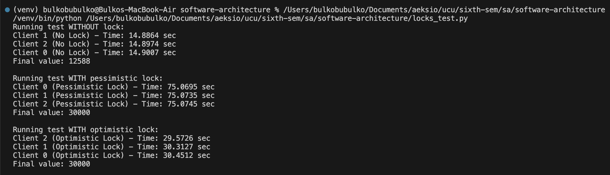

# Homework 2

#### 1. Setup
[Install Docker](https://docs.docker.com/get-docker/)

And dependencies:
```
pip install -r requirements.txt
```

#### 2. Configure and run 3 Hazelcast nodes in a cluster

Create a new Docker network
```
docker network create hazelcast-network
````

Add members (nodes):

```
docker run \
    --name hazelcast1 \
    -it \
    --network hazelcast-network \
    --rm \
    -e HZ_NETWORK_PUBLICADDRESS=172.18.0.1:5701 \
    -v ./hazelcast.yaml:/opt/hazelcast/config/hazelcast.yaml \
    -e HZ_CLUSTERNAME=dev \
    -p 5701:5701 hazelcast/hazelcast:5.3.8
```
```
docker run \
    --name hazelcast2 --network hazelcast-network \
    -v ./hazelcast.yaml:/opt/hazelcast/config/hazelcast.yaml \
    -e HZ_NETWORK_PUBLICADDRESS=172.18.0.1:5702 \
    -e HZ_CLUSTERNAME=dev \
    -p 5702:5701 hazelcast/hazelcast:5.3.8
```
```
docker run \
    --name hazelcast3 --network hazelcast-network \
    -v ./hazelcast.yaml:/opt/hazelcast/config/hazelcast.yaml \
    -e HZ_NETWORK_PUBLICADDRESS=172.18.0.1:5703 \
    -e HZ_CLUSTERNAME=dev \
    -p 5703:5701 hazelcast/hazelcast:5.3.8
```

Start Management Center:
```
docker run \
    --network hazelcast-network \
    -v ./hazelcast.yaml:/opt/hazelcast/config/hazelcast.yaml \
    -p 8080:8080 \
    hazelcast/management-center:5.3
```

Or you can also run with `docker-compose.yml`:

```
docker-compose down --remove-orphans && docker-compose up --build
```

#### 3. Distributed Map 

The script for this task is defined in: `populate_map.py`

After running the script we can check the key distribution in Management Center (http://localhost:8080):


Now we test node failures:

##### a. Stop one node
```
docker stop hazelcast1
```


No data loss.


##### b. Stop two nodes sequentially
```
docker stop hazelcast1
docker stop hazelcast2
```


No data loss.

##### c. Stop two nodes simultaneously
```
docker stop hazelcast1 hazelcast2
```


Here we observe data loss, this is due to the fact that Hazelcast configuration uses a backup count of 1, i.e, each piece of data is stored on one primary node and one backup node.

When we consider our three-node cluster and want to prevent data loss, we can configure a backup count of 2, this will ensure each piece of data is stored on all three nodes.

To achive this we can create custom config in `docker-compose.yml` by adding:
```
environment:
  - JAVA_OPTS=-Dhazelcast.map.backup-count=2
```

#### 4-7. Distributed Map without locks, with pessimistic lock and with optimistic lock.

The script for this task is defined in: `locks_test.py`



When running the test without locks, data loss occurs due to race conditions, leading to a final value lower than the expected 30,000. This approach is the fastest but unreliable for simultaneous updates.

With pessimistic locking, each client locks the key before updating it, ensuring the correct final value of 30,000. However, this approach is the slowest since only one client can update the key at a time.

Optimistic locking also guarantees the correct final value by updating the key only if it hasn’t been modified by another client. This method is faster than pessimistic locking but still slower than the no-lock approach.

#### 8. Bounded queue 

The script for this task is defined in: `queue_test.py`

Also we need to set bounded queue to 10 elements, to achieve this  moddify  `run` command by adding
```
-v ./hazelcast.yaml:/opt/hazelcast/config/hazelcast.yaml \
```
which i already did in task 2. 

Or if you use `docker-compose.yml` moddify it as:
```
volumes:
    - ./hazelcast.yaml:/opt/hazelcast/config/hazelcast.yaml
```

And yes, be sure to include `hazelcast.yaml` file.


One client writes values from 1 to 100 into the queue, while two other clients read from it. As expected if the queue is full and no consumers are reading, the producer is blocked, and the messages are consumed by the two clients in the order they become available.

<3